# Daily Planet Next.js SPA (Magnolia CMS Integration)  

A simple **Magnolia CMS + Next.js SPA** exploratory project inspired by the *Daily Planet* theme. This project explores the integration of **Magnolia CMS** with **Next.js**, showcasing how CMS content can be rendered in a modern React-based frontend.  


---

## 📦 Tech Stack

- **Magnolia CMS Community Edition** – Headless CMS for managing content
- **Next.js** – React-based framework for SPA and SSR
- **Tailwind CSS** – Styling
- **React** – Component-based UI
- **YAML** - For light module development

---

## 🚀 Main Features

### Pages

- **Home**  
  🏠 The main landing page of the site
  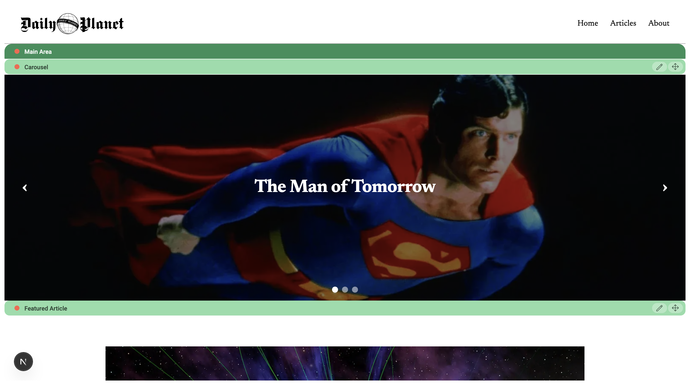
- **General**  
  📄 Other pages under home
  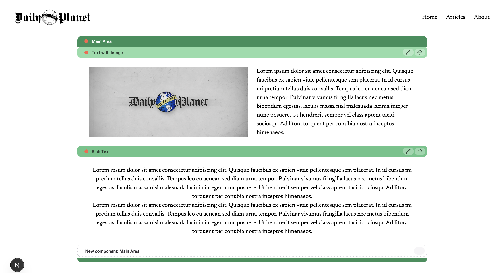
- **Article List**  
  📰 A listing of article pages
  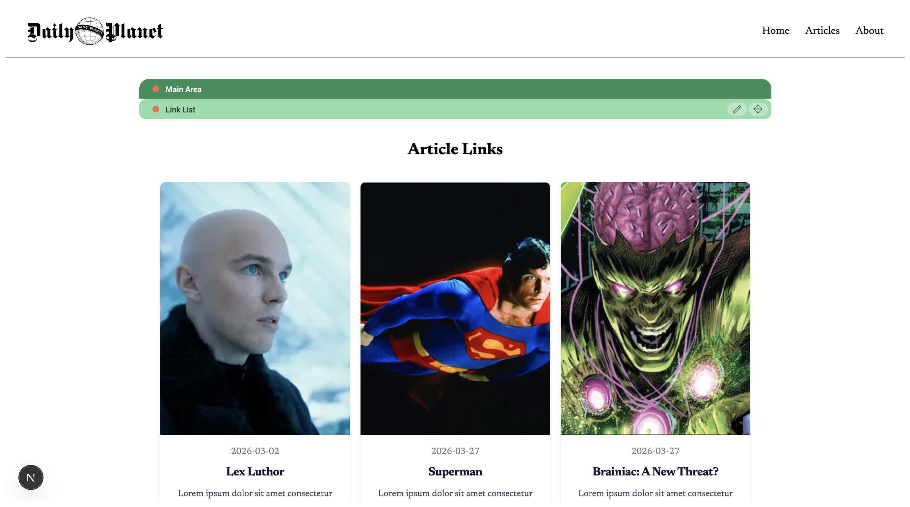
- **Article**  
  ✏️ Individual article pages
  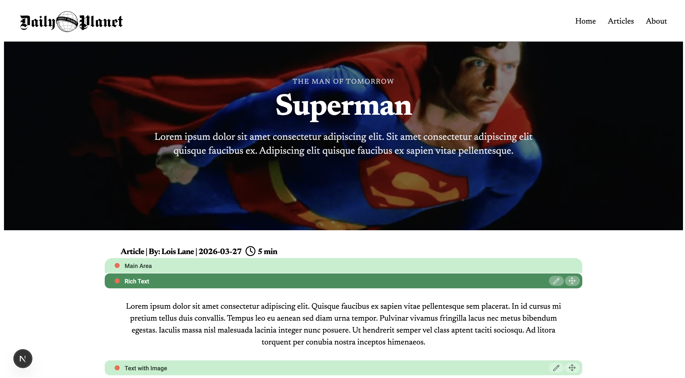
---

### Components

- **Rich Text**  
  📝 Display formatted text content from Magnolia CMS  
  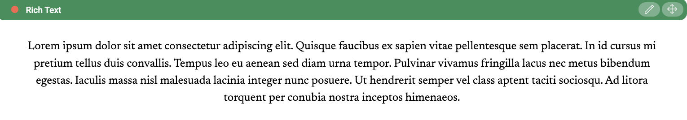

- **Text With Image**  
  🖼️ Text content with an accompanying image  
  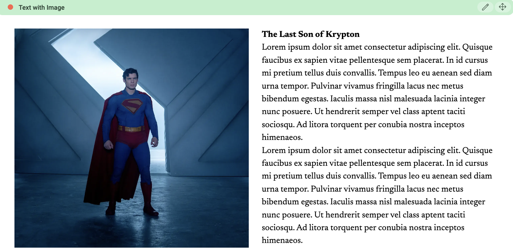

- **Hero**  
  🌟 Large featured image with title/description for highlights  
  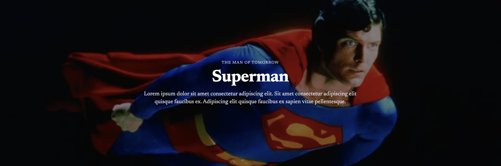

- **Carousel**  
  🎞️ Slideshow of articles or featured images  
  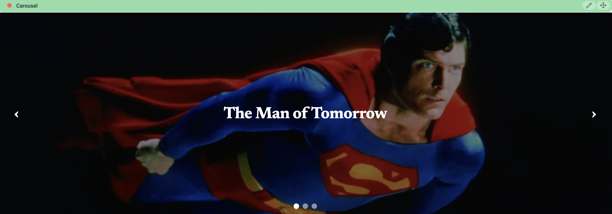

- **Link List with Cards**  
  📇 A grid of cards linking to different pages/articles  
  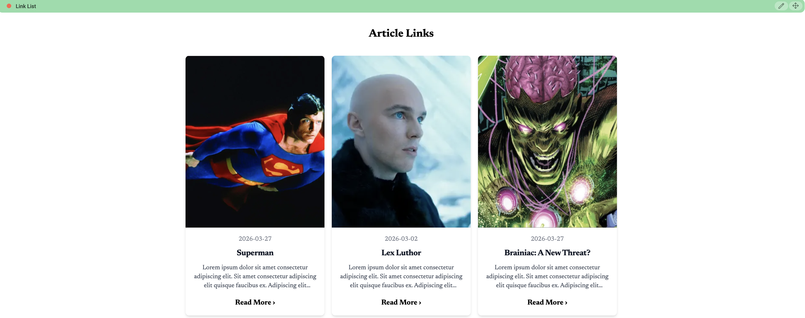

- **Feature Article**  
  📰✨ Highlights a single featured article with hero image, title, and summary  
  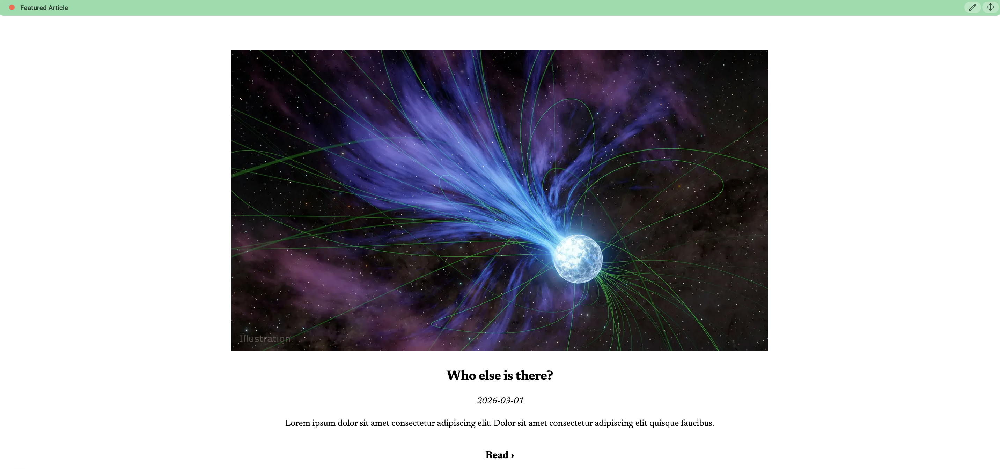

- **IFrame**  
  📰✨ Displays an embedded web page or external content within the application.
  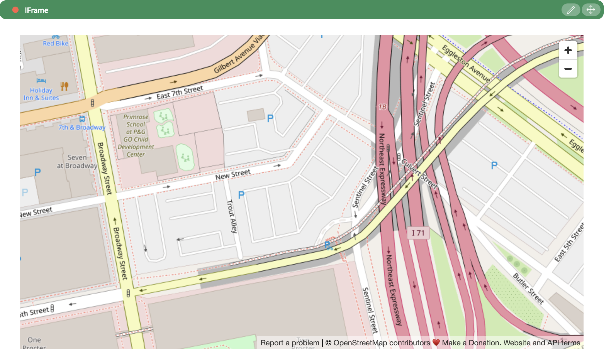

---

### Other Components

- Navbar
- Footer

---

## 🛠️ Getting Started

1. Clone the repository:  

```bash
git clone https://github.com/kirkalyn13/daily-planet-mgnl-spa.git
```

2. Download Dependencies

```bash
npm install
```

3. Run Magnolia CMS Community Edition

> ❗ Magnolia CMS CE Boilerplate is not included in this repo.

```bash
npm run dev
```

4. On a separate terminal, navigate to the `/spa` folder.

```bash
cd spa
```

5. Run Next.JS SPA app

```bash
npm run dev
```

6. Visit http://localhost:8181 in your browser.

## ⚡ Project Highlights

Uses Magnolia CMS as a headless CMS to manage pages and content.
Fully responsive Next.js frontend using Tailwind CSS.
Modular component structure for easy experimentation and reuse.
SPA-like behavior with fast navigation between pages.
Exploratory implementation of rich content components like Hero, Carousel, and Card grids.

## Author

- [Engr. Kirk Alyn Santos](https://github.com/kirkalyn13)